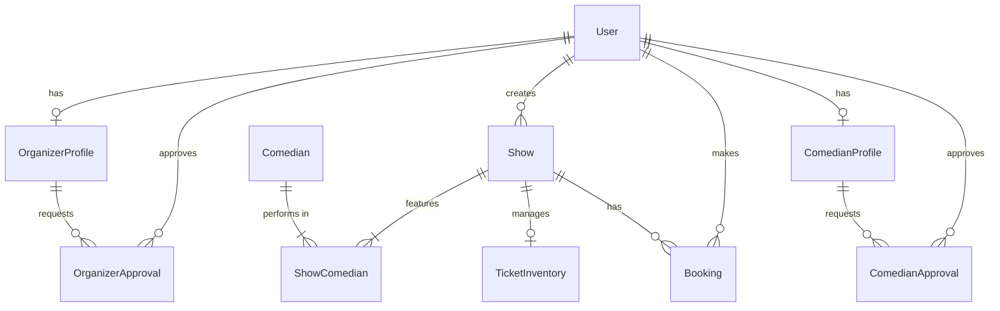

# Database Documentation

The application uses **PostgreSQL** as the primary database, managed via **Prisma ORM**.

## Core Models

### User Management
- **`User`**: The central entity for all users.
  - Roles: `AUDIENCE`, `ORGANIZER_UNVERIFIED`, `ORGANIZER_VERIFIED`, `ADMIN`, `COMEDIAN_UNVERIFIED`, `COMEDIAN_VERIFIED`.
  - Auth: Integration with NextAuth.js (`Account`, `Session`).
  - Profile: Includes fields for name, bio, interests, and admin-specific security fields.
- **`OrganizerProfile`**: Extended profile for users with organizer roles.
  - Linked one-to-one with `User`.
  - Includes venue details, approval status.
  - **New Fields**: `customPlatformFee` (override global fee), `youtubeUrls`, `instagramUrls`.
- **`OrganizerApproval`**: Tracks the approval process for organizer accounts.
  - Links `OrganizerProfile` with the `User` (Admin) who approved/rejected it.
  - Status: Recorded via `ApprovalStatus`.
- **`ComedianProfile`**: Extended profile for users with comedian roles.
  - Linked one-to-one with `User`.
  - Includes stage name, bio, contact info.
  - **New Fields**: `customPlatformFee`, `youtubeUrls`, `instagramUrls`.
- **`ComedianApproval`**: Tracks the approval process for comedian accounts.
  - Links `ComedianProfile` with the `User` (Admin) who approved/rejected it.

### Content & Events
- **`Show`**: Represents a comedy event.
  - Contains details like title, venue, price, and date.
  - **New Fields**:
    - `isDisbursed`: Boolean to track if earnings have been paid out.
    - `customPlatformFee`: Specific fee percentage for this show.
    - `youtubeUrls`, `instagramUrls`: Media links.
  - Linked to the creator (`User`) and performers (`Comedian`).
- **`Comedian`**: Profile for a performer (Legacy/Simple).
  - Created by organizers.
  - Can be associated with multiple shows.
- **`ShowComedian`**: Join table managing the many-to-many relationship between `Show` and `Comedian`.
  - Includes metadata like performance order.

### Commerce
- **`Booking`**: Records a user's purchase for a show.
  - Statuses: `PENDING`, `CONFIRMED`, `CANCELLED`, etc.
  - **New Fields**:
    - `platformFee`: Calculated commission for the platform.
    - `bookingFee`: Convenience fee added on top.
  - Links `User` and `Show`.
- **`TicketInventory`**: Manages ticket availability and locking mechanisms to prevent overbooking.

### Configuration
- **`PlatformConfig`**: Stores global system settings (e.g., default fee percentages).
  - Key-Value pair storage (Value is JSON).

## Enums

- **`UserRole`**: Defines permissions.
  - `AUDIENCE`: Standard user.
  - `ORGANIZER_UNVERIFIED`: Applied to be an organizer.
  - `ORGANIZER_VERIFIED`: Approved to create shows.
  - `ADMIN`: Platform administrator.
  - `COMEDIAN_UNVERIFIED`: Applied to be a comedian/performer.
  - `COMEDIAN_VERIFIED`: Approved comedian.
- **`BookingStatus`**: Tracks the lifecycle of a booking.
- **`ApprovalStatus`**: Tracks the state of organizer/comedian requests (`PENDING`, `APPROVED`, `REJECTED`).

## Relationships Diagram (Conceptual)

