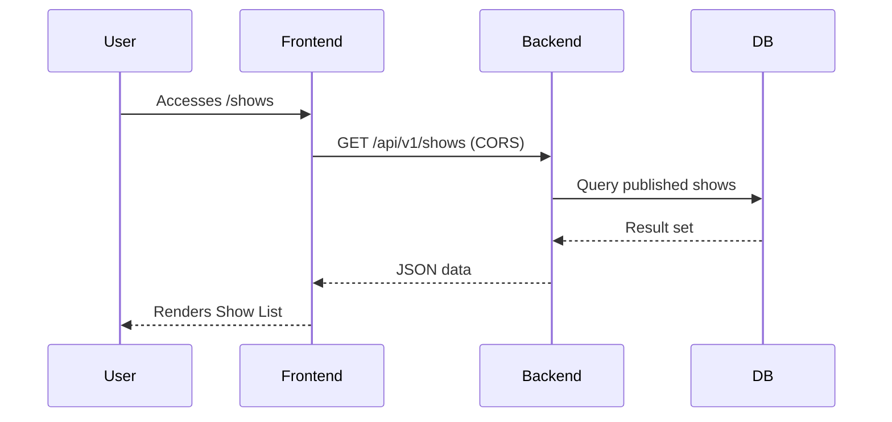

# User Workflows: Decoupled Architecture

This document describes how users and data flow through Comedy Connect in the decoupled monorepo setup.

## 🗺️ High-Level Interaction

---

## 👤 User Flow: Booking a Ticket

1. **Discovery**: User browses shows on `packages/frontend`.
2. **Auth Check**: User clicks "Book Now". If not logged in, Frontend redirects to Backend Auth.
3. **Authentication**:
   - Backend redirects to Google Login.
   - On success, Backend saves session in DB and returns the user to the caller.
4. **Booking Selection**: User selects ticket quantity.
5. **Transaction**:
   - Frontend POSTs to `${BACKEND_URL}/api/v1/bookings`.
   - Backend starts a Prisma Transaction.
   - Backend verifies `TicketInventory`.
   - Backend creates `Booking` and decrements `TicketInventory`.
   - Backend commits.
6. **Confirmation**: Frontend receives success and renders ticket view.

---

## 🎭 Organizer Flow: Creating a Show

1. **Onboarding**: New user completes profile.
2. **Verification**: Admin verifies the Organizer in the Backend.
3. **Show Creation**: 
   - Organizer submits show details on the Dashboard.
   - Backend validates the `CreateShowRequest`.
   - Show is saved as `isPublished: false`.
4. **Publishing**: Organizer clicks "Publish". Backend checks dates and inventory, then flips the flag.

---

## 🛡️ Admin Flow: Secure Oversight

1. **Portal Access**: Admin accesses `/admin` on the Frontend.
2. **First-Tier Auth**: Verify role is `ADMIN` via standard session.
3. **Second-Tier Auth**: Admin enters password.
    - Frontend POSTs to `/api/admin-secure/login`.
   - Backend verifies password and sets a secure short-lived cookie.
4. **Action**: Admin can now perform sensitive tasks (Disbursement, Fee Changes).
